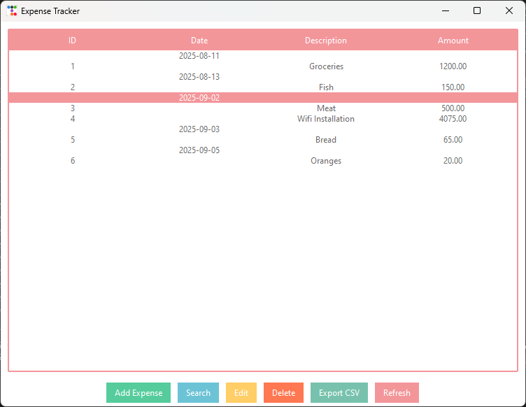

💰 Expense Tracker
A simple and modern Expense Tracker built with Python and TTKBootstrap for a clean and user-friendly interface.
It allows you to record, edit, search, group, and export expenses — perfect for personal budgeting and expense management.

✨ Features
📅 Group expenses by date

➕ Add new expenses with date, description, and amount

✏ Edit existing entries directly from the interface

🔍 Search expenses by date or keyword

🗑 Delete unwanted entries

📊 Export all data to CSV for backup or analysis

🎨 Modern UI powered by TTKBootstrap

📸 Screenshots

🛠 Installation
Clone the repository

git clone https://github.com/leonardorong/Expense-Tracker
cd Expense-Tracker
Install dependencies

pip install ttkbootstrap
Run the app

python expense_tracker.py
📂 Project Structure

Expense-Tracker/
│── expense_tracker.py   # Main application
│── expenses.txt         # Data file (auto-created if missing)
│── README.md            # Project documentation
📌 Usage Notes
Expenses are stored in a text file (expenses.txt) in the same folder.

CSV export will generate a .csv file you can open in Excel or Google Sheets.

🤝 Contributing
Pull requests are welcome!
For major changes, please open an issue first to discuss what you’d like to change.

📜 License
This project is licensed under the MIT License — feel free to use and modify.

👤 About Me
Hi! I’m Leonard Rongoma, a passionate Python learner and aspiring software developer.
I build practical tools that solve real problems — from expense trackers to automation scripts — while continuously improving my skills.

💼 Open to freelance coding projects

🌍 Based in Kenya, available for remote work

💡 Love building things that save time and money

🔗 Connect With Me
📧 Email: leonardrongoma3@gmail.com

🐙 GitHub: github.com/leonardorong